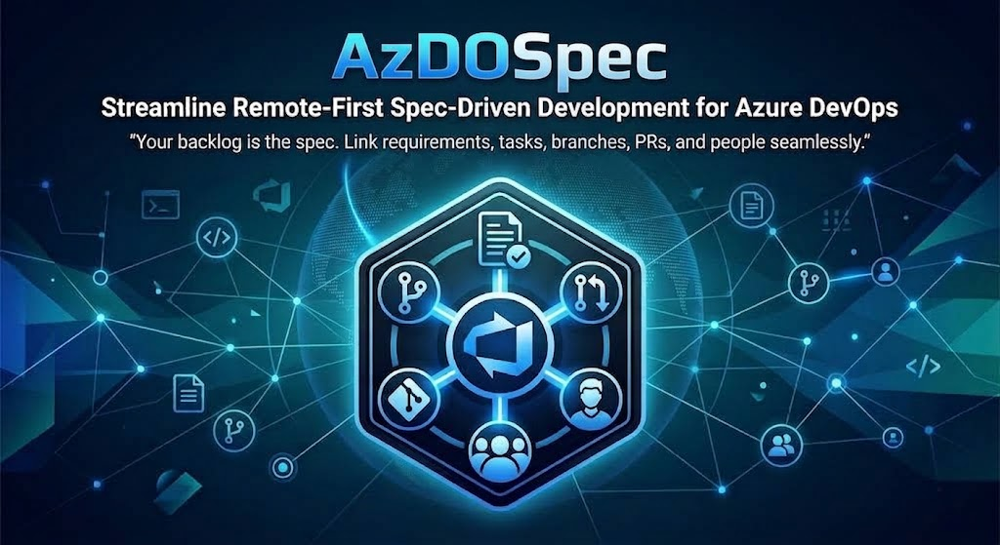

<p align="center">
  <a href="https://github.com/Gn0m0-dei/azdospec">
    
  </a>
</p>

<p align="center">
  <a href="./LICENSE"></a>
  <a href="https://www.skills.sh"></a>
  <a href="#claude-code--as-a-plugin"></a>
  <a href="#opencode"></a>
  <a href="#any-agent-skills-host"></a>
  <a href="https://learn.microsoft.com/azure/devops/mcp-server/mcp-server-overview"></a>
  <a href="./CHANGELOG.md"></a>
  <a href="https://github.com/Gn0m0-dei/azdospec/stargazers"></a>
</p>

<h1 align="center">AzDOSpec</h1>

<p align="center">
  <strong>Your backlog is the spec.</strong>
</p>

> **Status: design phase.** The model is settled and the commands are written.
> Not yet exercised against enough real projects to call it stable.

An agent skill that runs spec-driven development entirely inside Azure DevOps.
[OpenSpec](https://github.com/Fission-AI/OpenSpec) keeps proposals, specs and
tasks as Markdown in an `openspec/` folder inside the repository. AzDOSpec keeps
the same model and drops the folder: every artifact is a native Azure Boards work
item, every relationship is a native link, and the agent reads the current state
from the board rather than the filesystem.

The result is one source of truth the whole team already looks at, where a
requirement is connected to the branch that implements it, the pull request that
merges it, the tests that verify it and the person who owns it.

Built on the open [Agent Skills](https://www.skills.sh) standard, so it works
with any compatible agent — Claude Code, opencode, pi, and others.

## How it maps

| OpenSpec | Azure DevOps |
|---|---|
| Capability | Area Path |
| `proposal.md` | Feature — a single backlog item when the change has one requirement, an Epic when it spans Features |
| Requirement + scenarios | Backlog item (User Story / Product Backlog Item / Requirement / Issue, per process) with Gherkin acceptance criteria and an `ADDED` / `MODIFIED` / `REMOVED` tag |
| `design.md` | Description of the Feature |
| `tasks.md` | Checklist while proposed; child Tasks once the item reaches a sprint |
| Dependencies | `Predecessor / Successor` and `Related` links |
| `specs/` | Spec store — see below |
| Archive | Deltas applied to the spec store, items moved to Done |

Capabilities are Area Paths rather than long-lived work items on purpose: a
backlog is a list of work, and an item that never closes distorts every board,
rollup and forecast it appears on. The reasoning behind this and the other
non-obvious choices is in [how it maps](./docs/how-it-maps.md).

Traceability is native throughout — parent/child hierarchy, `AB#<id>` in commits
and pull requests, branch links, pull request completion transitioning the linked
work items, and a branch policy that refuses a pull request with no work item
attached.

## Commands

| Command | What it does |
|---|---|
| `/azdo:init` | Once per repository. Resolves organization and project from the git remote, detects the available spec store, configures the branch policy and writes `.azdospec.json`. |
| `/azdo:propose <idea>` | Reads the current spec, drafts the whole change — Feature, one requirement per delta, task checklist — shows it as a single draft, and creates and links everything once you approve. |
| `/azdo:apply` | Refuses unless a product owner approved the requirement and it has an iteration. Creates the tasks, derives parallel streams from the dependency links, creates the branch from the work item and posts progress as comments. |
| `/azdo:archive` | Verifies the tasks are Done, folds the deltas into the spec store and closes the change. |

Full detail in [commands](./docs/commands.md).

## Spec store

Where the merged, living specification of each capability lives. Chosen once by
`/azdo:init`, driven by what your organization actually licenses:

| Store | Requires | What it does |
|---|---|---|
| `testplans` | Basic + Test Plans | Each scenario becomes a Test Case — `Design` while proposed, `Ready` once archived, `Closed` when removed — in a suite per Area Path, linked `Tests / Tested By` to its requirement. Specification by example: the spec is executable. |
| `wiki` | Basic | Default when Test Plans is not licensed. One page per Area Path, rewritten on archive. |
| `epic` | Basic | Opt-in. One long-lived Epic per Area Path holding the spec in its description. Works anywhere, at the cost of a backlog item that never closes. |
| `none` | — | Opt-in. No merged spec; the agent reads the Done items of the Area Path. |

See [spec stores](./docs/spec-stores.md) for how to choose.

## Requirements

- An agent that supports [Agent Skills](https://www.skills.sh) or Claude Code plugins.
- A connection to the [Azure DevOps MCP Server](https://learn.microsoft.com/azure/devops/mcp-server/mcp-server-overview). Every artifact is a work item, so there is no offline mode. Installing as a Claude Code plugin configures this for you.
- A repository whose remote is an Azure DevOps repository.

## Install

### Claude Code — as a plugin

```
/plugin marketplace add Gn0m0-dei/azdospec
/plugin install azdo
```

This registers `/azdo:init`, `/azdo:propose`, `/azdo:apply` and `/azdo:archive`
as real commands, and configures the Azure DevOps MCP server for you — it asks
for your organization name on install and connects to the remote server, so
there is no token to create or store.

### opencode

Copy `.opencode/command/` into your project or `~/.config/opencode/`, which
registers `/azdo-init`, `/azdo-propose`, `/azdo-apply` and `/azdo-archive`, and
install the skill as below.

opencode does not let an installed package write your configuration, so declare
the MCP server yourself in `opencode.json`:

```json
{
  "$schema": "https://opencode.ai/config.json",
  "mcp": {
    "azure-devops": {
      "type": "remote",
      "url": "https://mcp.dev.azure.com/<your-organization>"
    }
  }
}
```

That is the only manual step compared to the Claude Code plugin.

### Any Agent Skills host

```bash
npx skills add Gn0m0-dei/azdospec
```

Or copy the skill folder (`skills/azdospec/`, the one containing `SKILL.md`)
into the skills directory your agent reads — `~/.claude/skills/azdospec/`,
`~/.config/opencode/skills/azdospec/`, `~/.pi/agent/skills/azdospec/`, or the
project-local equivalent. Most agents also read `.agents/skills/`.

Installed this way there are no slash commands: ask for what you want and the
skill activates by description, and the MCP server is configured however your
agent documents it. On pi, `.agents/plugins/marketplace.json` in this repository
is the install entry.

| Host | Commands | MCP configured for you |
|---|---|---|
| Claude Code | `/azdo:init`, `propose`, `apply`, `archive` | Yes, on install |
| opencode | `/azdo-init`, `azdo-propose`, `azdo-apply`, `azdo-archive` | No — three lines in `opencode.json` |
| pi and other Agent Skills hosts | None; the skill activates by description | No |

## Documentation

→ **[Getting Started](./docs/getting-started.md)** — install, set up a repository, first change<br>
→ **[Commands](./docs/commands.md)** — what each one does, and what it refuses to do<br>
→ **[How It Maps](./docs/how-it-maps.md)** — the reasoning behind the model<br>
→ **[Spec Stores](./docs/spec-stores.md)** — where the living spec lives<br>
→ **[FAQ](./docs/faq.md)**

## Layout

```
skills/azdospec/          # the skill itself — portable to any Agent Skills host
├── SKILL.md              # model, commands, hard rules
└── references/
    ├── work-items.md     # types, fields, links, delta tags
    ├── init.md · propose.md · apply.md · archive.md

.claude-plugin/           # Claude Code plugin manifest and marketplace entry
.mcp.json                 # the Azure DevOps MCP server the plugin configures
commands/                 # /azdo:init · propose · apply · archive
.opencode/command/        # the same commands for opencode
.agents/                  # marketplace entry for agents-standard hosts
```

`SKILL.md` is loaded whenever the skill activates; `references/` files are read
on demand, so only the detail a command actually needs enters the context.

The command files are deliberately thin — each one points at its procedure in
`references/`. The behaviour lives in the skill and nowhere else, so the per-host
packaging cannot drift away from it.

## Credits

The artifact model comes from [OpenSpec](https://github.com/Fission-AI/OpenSpec);
the execution discipline — progress comments, dependency-driven parallel work,
one branch per change — from [CCPM](https://github.com/automazeio/ccpm). Both are
local-first. AzDOSpec is the remote-first take on the same idea.

## Contributing

See [CONTRIBUTING.md](./CONTRIBUTING.md). Open an issue before a pull request
that changes behaviour — the mapping is deliberate, and a discussion is cheaper
than a rewritten pull request.

## License

MIT — see [LICENSE](./LICENSE).
